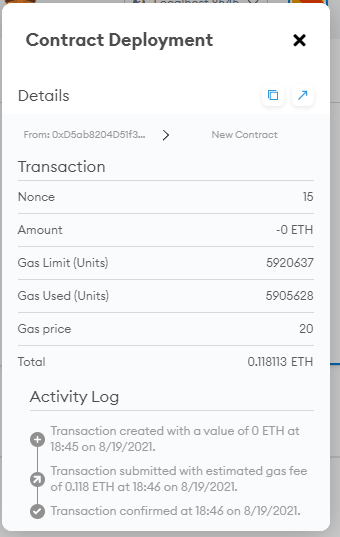

# 21-Advanced-Solidity

## Required imports

The following import are for needed to bootstrap the contract by   inheriting the following OpenZeppelin contracts.

import PupperCoin.sol";

[github crowdsale.sol](https://github.com/OpenZeppelin/openzeppelin-contracts/blob/release-v2.5.0/contracts/crowdsale/)

[github MintedCrowdsale.sol](https://github.com/OpenZeppelin/openzeppelin-contracts/blob/release-v2.5.0/contracts/crowdsale/emission/)

[github CappedCrowdsale.sol](https://github.com/OpenZeppelin/openzeppelin-contracts/blob/release-v2.5.0/contracts/crowdsale/validation/)

[github TimedCrowdsale.sol](https://github.com/OpenZeppelin/openzeppelin-contracts/blob/release-v2.5.0/contracts/crowdsale/validation/)

[github RefundablePostDeliveryCrowdsale.sol](https://github.com/OpenZeppelin/openzeppelin-contracts/blob/release-v2.5.0/contracts/crowdsale/distribution/)

### Crowdsale
- The puppercoin contract created and for this contract  a standard ERC20Mintable and ERC20Detailed will be use 

- A PupperCoinSaleDeployer contract was also created with an address that was set to public. 

- A constructor function was created for the name, symbol and wallet.

- A PupperCoin Token created inorder to store the address.

- PupperCoinSale that set the goal, the open and close of the sales and also the description about the coin.

- The below are the parameter to deploy PupperCoin

The below is the PupperCoin transaction confirmation

The below are the parameter to deploy PupperCoinSaleDeployer

The below is the PupperCoinSaleDeployer transaction confirmation

